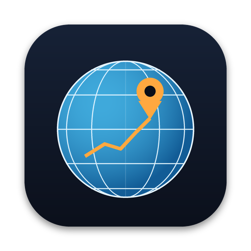

  

<h1 align="center">GeoScreen64</h1>

<h3 align="center">The Earth on your Mac.</h3>

  The best of Google Earth Pro and Garmin BaseCamp — in one free, native Mac app.

  <a href="https://github.com/akeisoft/GeoScreen64/releases/latest/download/GeoScreen64.dmg"><b>⬇&nbsp;&nbsp;Download for Mac</b></a>
  &nbsp;&nbsp;·&nbsp;&nbsp;
  <a href="https://akeisoft.com">akeisoft.com</a>

  
  
  
  

<!-- A window screenshot with the English interface fits here:

-->

---

Open any map file and watch it come alive on a 3D globe. **GeoScreen64** lets you measure the land, trace elevation over shaded relief, lay old maps over today's world, turn your tracks into 4K fly-through videos, and send routes and custom maps straight to your Garmin.

<table>
  <tr>
    <td align="center" width="33%">⚡ <b>Native</b> Built for macOS from the ground up. Fast, light, at home on your Mac.</td>
    <td align="center" width="33%">🔒 <b>Private</b> Your files never leave your Mac. No account, no ads, no tracking.</td>
    <td align="center" width="33%">🧡 <b>Free</b> Every feature, for everyone. Updates arrive automatically.</td>
  </tr>
</table>

## What it does

| | |
|:--|:--|
| 🗂️&nbsp;**Every format** | KML, KMZ, GPX, FIT, Shapefile, GeoJSON, CSV, Excel, MBTiles |
| 📏&nbsp;**Measure and explore** | Distances, areas, circles, elevation profiles, slopes and contour lines |
| 🗺️&nbsp;**Old maps, new life** | Overlay a scan, fit it by its corners, compare with today's map using a swipe |
| 🎬&nbsp;**Fly-through videos** | Cinematic 4K flights along any track, relief and old maps included |
| 🧭&nbsp;**Garmin-ready** | Waypoints, routes, geocaches and custom maps, sent in one click |
| 📸&nbsp;**Photos on the map** | Geotag your pictures from a GPS track — RAW included |
| 🖨️&nbsp;**Print-perfect** | PDF maps with scale bars, legend and coordinate grids |
| 🌐&nbsp;**Speaks your grid** | UTM, MGRS and national systems across Europe and the US |

## Get started

1. **Download** the disk image and drag GeoScreen64 into Applications.
2. **Open** your KML, GPX or any other map file — or simply drop it onto the map.
3. **Explore.** New versions arrive by themselves; you can also check from **ⓘ → Check for Updates…**

## Requirements

- macOS 14 Sonoma or later
- English, Deutsch, Français, Українська, Русский

---

  
    © 2026 <a href="https://akeisoft.com">AKEISOFT</a>. GeoScreen64 is free, closed-source software. 
    Not affiliated with Google or Garmin. Google Earth is a trademark of Google LLC;
    Garmin and BaseCamp are trademarks of Garmin Ltd. or its subsidiaries.
  

